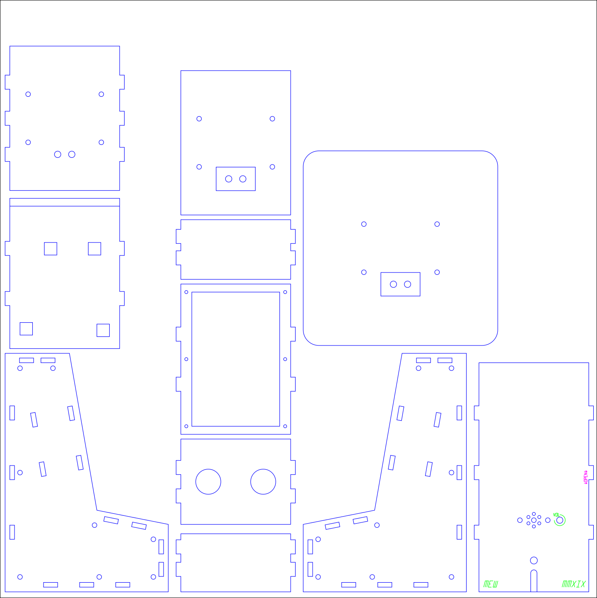
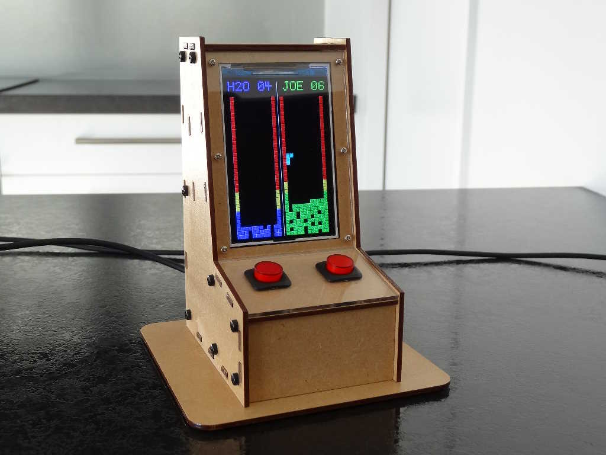

# Inksnek
Inksnek is a _Python_ class working in an Extension in _Inkscape_. It's evolved over 10 years to help me create (**_code_**) laser-cut enclosures like this:  



The class provides helper methods for structuring a design in a hierarchy of groups and for adding cut lines as rectangles, circles and arbitrary paths etc.  
There is some build-in support for a simple stroked font.  
So, for example, code like this:
```
  def add_plate(self, group, x, y):
    # cut plate outline
    inksnek.add_round_rect(group, x, y, self.plate_width, self.plate_height, self.plate_radius, inksnek.cut_style)
    # 4 corner holes (cut)
    inksnek.add_hole(group, x + self.hole_offset,                    y + self.hole_offset,                     self.hole_radius)
    inksnek.add_hole(group, x + self.plate_width - self.hole_offset, y + self.plate_height - self.hole_offset, self.hole_radius)
    inksnek.add_hole(group, x + self.hole_offset,                    y + self.plate_height - self.hole_offset, self.hole_radius)
    inksnek.add_hole(group, x + self.plate_width - self.hole_offset, y + self.hole_offset,                     self.hole_radius)
    # label/annotation in non-cutting style
    inksnek.add_annotation(group, self.plate_width/2, self.plate_height/2, "Simple Plate", 5.0, inksnek.ignore_style, inksnek.MID_ALIGN + inksnek.CENTRE_ALIGN)
    
  def effect(self):  # the main entry point for the design
    # initialise Inksnek
    inksnek.setup(self, inksnek.A4, inksnek.ACRYLIC, 3.0, 'mm', inksnek.DEVEL)
    # design parameters
    self.plate_width = 100.0
    self.plate_height = 60.0
    self.plate_radius = 3.0 # radius of rounded corners
    self.hole_radius = 2 # m3
    # x & y offset from sides to hole centre
    self.hole_offset = 3
    # make a group
    design = inksnek.add_group(inksnek.top_group, inksnek.translate_group(7.0, 7.0))
    # add the plate
    self.add_plate(design, 0, 0);

```
produces a simple laser-cut plate design like this


Refer to the docs directory for information about installation, programming and a reference.  
Also see the samples directory.

I created the class to assist my creation of laser-cut project enclosures in _Inkscape 0.92_, to be sent to Ponoko.com.
I've modified it for **Inkscape 1.3.2**, cleaned it up, rationalised it. I don't use Ponoko any more but it still has some holdovers from that time (templates etc).  
I also wrote it in CamelCase but I have converted it to snake_case to be _slightly_ more Pythonic.

