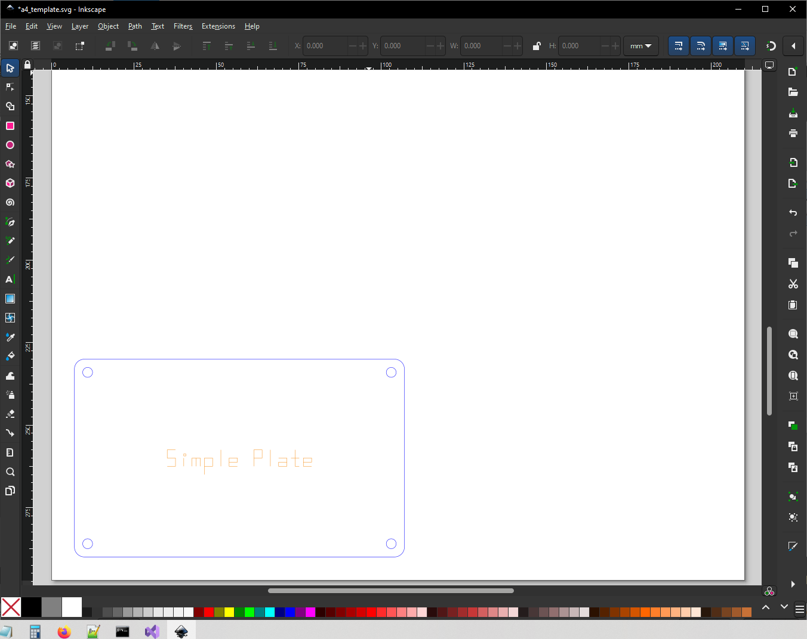

# SETUP
In this setup there are two extension menu items for two projects on-the-go.  
To set up Inksnek:  
1. First install Inkscape (I’m assuming `c:\Program Files\Inkscape1.3.2`).
2. Then unpack the Inksnek folder (I’m assuming `c:\inksnek`).
3. Then copy the `.py` and `.inx` files from  
`c:\inksnek\extensions`  
into  
`c:\Program Files\Inkscape1.3.2\share\inkscape\extensions`  

Inksnek should now be ready to go.

# TRY IT
Run Inkscape and open  
`c:\inksnek\a4_template.svg`  
In the Extensions menu you should see an “Inksnek” entry with “Inksnek Design” and “Inksnek Design 2” items. 
Select “Inksnek Design”.
You should see a design with a simple plate in the bottom left, like this:  


Try making a change – make the holes m4 and move them closer to the edges. In the editor of your choice, open
`c:/inksnek/samples/simple_plate.py`  
Go to line around line 32 and change
```
    self.hole_radius = 1.5
    self.hole_offset = 4
```
to
```
    self.hole_radius = 2.0
    self.hole_offset = 3
```

Save the file. Switch back to Inkscape. Press _Ctrl-Z_ to undo the previous render, then _Alt-Q_ to re-run the last extension. You should now see an updated design, like this:
  
This is how I work on a design, switching back and forth between my editor and Inkscape, making changes to the Python code, then undoing the previous iteration and re-doing the new one, in Inkscape.  Note that sometimes it’s useful to skip the undo step and see the old and the new overlaid.

# DIRECTORIES
There are three directories in this setup.  
## Directory 1, Hooks:
The first directory is  
`c:\Program Files\Inkscape1.3.2\share\inkscape\extensions`  
This has the .inx files which add entries into the Inkscape Extensions menu, “Design” and “Design 2” under an “Inksnek” submenu. The corresponding Python files are stubs that simply call other files in the second directory. This gets us out of “Program Files” for more convenient editing. They are “set and forget” files.

## Directory 2, Links:
The second directory is `c:\inksnek`. This directory also has inksnek.py which defines the Inksnek class.
The two “hook” stub Python files in the Inkscape directory (above) just call these corresponding files  
`c:\inksnek\inksnek_extension_link.py`  
`c:\inksnek\inksnek_extension_link2.py`  
These link files are also stubs, they just call other Python files. Edit the link files to point to the specific design files you’re working on.  They start off pointing to designs in the Samples subdirectory.

## Directory 3, Projects:
The third level of directory is the individual project layer.  So for example `inksnek_extension_link.py` 
(above) is just 
```
#! /usr/bin/env python
# re-direct to the specific design/project
f = open("c:/inksnek/samples/simple_plate.py")
exec(f.read())
f.close()
```

It runs a specific design file in Inksnek Designs (sample) subdirectory.  Edit the open() path to match your requirements, like project files outside the Inksnek folder (don’t forget to use **forward** slashes).

To summarize:  
`extension hook -> design link -> specific design`  
or  
`inksnek_extension_hook.py -> inksnek_extension_link.py -> Enclosure.py`  
and  
`\extensions -> \inksnek -> \<Project>`  
Edit the link files to point to your design file, edit your design file to work on your project.
This may seem convoluted but it works for me!


